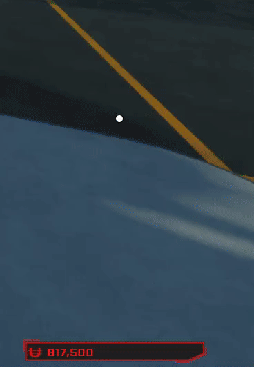

# UI-Examples

## Overview
This is a collection of UI I have made and scripted.

## Examples

- This first example is what players would see upon loading into the game for the first time.
  

- This second example is a phone UI for players to use and start missions with. All of the data within in the phone, such as, money, current property, and the contacts list, is called from ProfileService.

